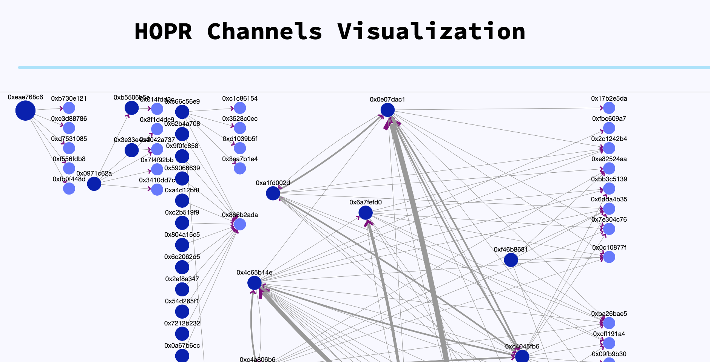

# HOPR Network Visualizer

[ETHDenver2022 hackathon submission](https://hackerlink.io/buidl/2104)



## Overview

> "The HOPR protocol relies on payment channels for the incentive layer of HOPR mixnet. Users need to see the topology of payment channels to make smart decisions to which other nodes they should open payment channels to. Being able to make smart decisions allows node operators to connect their node to other highly connected (and important) nodes and thereby relay a larger amount of packets - in order to increase their earnings for relaying packets."

## Features

- HOPR Network Visualizer is an interactive dashboard that shows HOPR network topology as a directed graph.

- A user can learn more details about individual open payment channels by tapping on edges of the graph; they can learn more about HOPR nodes by tapping on nodes. All addresses link directly to the block explorer for convenience.

- A slider at the top can be used to see the snapshot of the network topology at any point in time (indexed by block height).

## Tech stack

Event data gathering: web3.py with QuickNetwork Gnosis Chain node.

Graph datastructure construction and caching: TypeScript Express API.

Visualization: Dash Cytoscape.

## How to run

### Event data gathering

To scan [HoprContract](https://blockscout.com/xdai/mainnet/address/0xD2F008718EEdD7aF7E9a466F5D68bb77D03B8F7A/transactions) for relevant events:

```
pipenv --python 3.9
pipenv shell
pipenv install
python event_scanner.py $HTTP_PROVIDER
```

Where `$HTTP_PROVIDER` is Gnosis Chain HTTP RPC. It took about 50k RPC calls and a few hours to scan 1 month worth of events.

### Visualization

#### Terminal 1


Using node v17.5.0 and npm 8.4.1:

```
cd api
npm install
npm run serve
```

This starts graph network Express server. It constructs graph datastructures from events and does caching. 

Example endpont:

```
http://127.0.0.1:3000/network?format=cytoscape&blockHeight=20637852
```

#### Terminal 2

Requires `pipenv`:

```
pipenv --python 3.9
pipenv shell
pipenv install
python viz.py
```

This starts Dash server. The interactive dashboard is now visible at `http://localhost:8050`. Dash makes requests to Express server to get the correct graph network snapshot every time you use the slider to change the block height.
